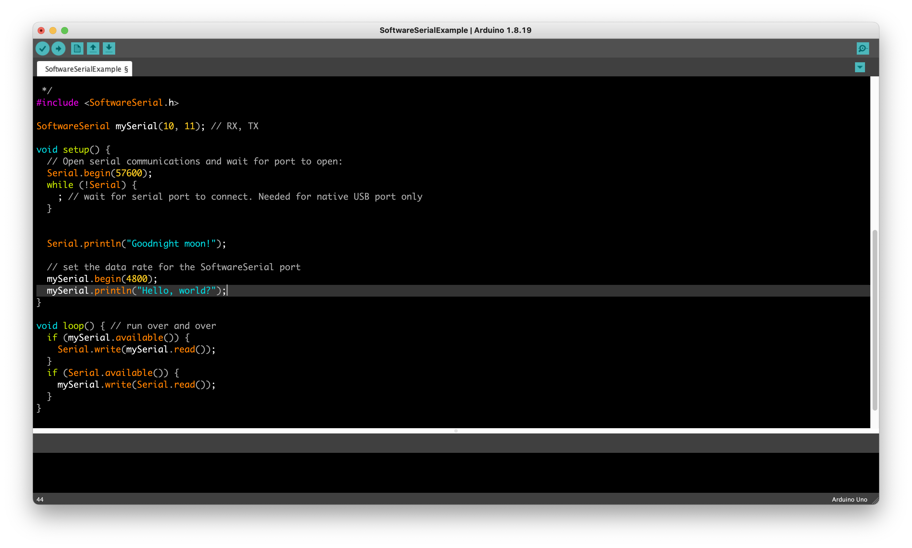

# Arduino-Black-Theme
[Total Black theme for Arduino IDE with bright fonts](https://github.com/JairajJangle/Arduino-Black-Theme)

Screenshot

# INSTALLATION PROCEDURE:

*Mac users:*
-------------

Look in ~/Applications/Arduino.app/Contents/Java/lib and replace the theme folder inside (making a copy of the original in case want to revert back).

*Windows users:*
-----------------

Look in your Arduino installatio forder eg: C:\Program Files(x86)\Arduino\lib and replace the theme folder inside (making a copy of the original in case want to revert back).

*Linux users:* 
---------------

Look in your Arduino installatio forder eg: /home/user_name/Arduino/lib and replace the theme folder inside (making a copy of the original in case want to revert back).

-------------------------------------------------------------------------

YOU CAN CREATE YOUR OWN MODS:
You need to edit the theme.txt file, an XML file inside the syntax folder, and the button files. Unfortunately, not all items in the theme.txt file actually work, so if you can't get an item to change, try another one of the files.

Thanks to https://github.com/jeffThompson/DarkArduinoTheme for dark theme of arduino, I have modified this theme to total black theme, this looks great on OLED screens.

# Buy Me A Coffee

